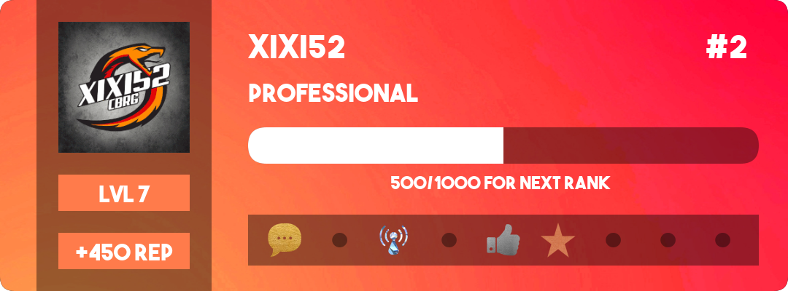

# Rank and Success Card

## Example

Here is an example of customisation possibilities:



```javascript
const canvas = require("discord-canvas"),
  rankCardCanvas = new canvas.RankCard();

let image = await rankCardCanvas
    .setAvatar("xixi52")
    .setXP("current", 500)
    .setXP("needed", 1000)
    .setLevel(7)
    .setRank(2)
    .setReputation(450)
    .setRankName("professional")
    .setUsername("xixi52")
    .setBadge(1, "gold")
    .setBadge(3, "diamond")
    .setBadge(5, "silver")
    .setBadge(6, "bronze")
    .setBackground("https://www.site.com/background.jpg")
    .toAttachment();

let attachment = new Discord.MessageAttachment(image.toBuffer(), "rank-card.png");

message.channel.send(attachment);
```


You can of course enter your variables.

```javascript
.setUsername("xixi52")
```

You can use for example:

```javascript
.setUsername(message.author.username)
```


## Functions

Here is the complete list of available functions

### `.setUsername`

Displays the Discord username

```javascript
.setUsername(variable)
```

### `.setAvatar`

Displays the Discord user avatar, you need use an URL

```javascript
.setAvatar(URL)
```

### `.setBackground` _\(optional\)_

Displays a background, you need use an URL

```javascript
.setBackground(URL)
```

### `.setXP`

Export your user experience values

```javascript
.setXP("current", 500) // XP POINTS IN THIS RANK
.setXP("needed", 1500) // XP POINTS NECESSARY FOR THE NEXT RANK
```

### `.setLevel`

Export your user level value

```javascript
.setLevel(variable)
```

### `.setReputation`_\(if addon is enabled\)_

Export your user reputation value

```javascript
.setReputation(variable)
```

### `.setRankName`_\(if addon is enabled\)_

Export your user rank name value

```javascript
.setRankName(variable)
```

### `.setRank`_\(if addon is enabled\)_

Export your user rank value

```javascript
.setRank(variable)
```

### `.setOpacity` _\(optional\)_

You can modify the opacity of blocks, you must enter a number between 0 and 1.

You can delete a block with opacity 0

```javascript
.setOpacity("avatar", 0.4) // Under the avatar
.setOpacity("badges", 0.4) // Badges box
.setOpacity("level", 1) // Level box
.setOpacity("backgroundBar", 0.4) // Background for progress bar
.setOpacity("reputation", 1) // Reputation box
.setOpacity("no-badges", 0.4) // If badge is locked
```

### `.setColor` _\(optional\)_

You can modify the color of any part of the card

```javascript
.setColor("background", "#000000") // BACKGROUND COLOR
.setColor("level-box", "#ff7b4b") // LEVEL BOX COLOR
.setColor("level", "#ffffff") // LEVEL COLOR
.setColor("reputation-box", "#ff7b4b") // REPUTATION BOX COLOR
.setColor("reputation", "#ffffff") // REPUTATION COLOR
.setColor("rank", "#ffffff") // RANK COLOR
.setColor("rank-name", "#ffffff") // RANK NAME COLOR
.setColor("username", "#ffffff") // USERNAME COLOR
.setColor("background-bar", "#ffffff") // BACKGROUND OF PROGRESS BAR COLOR
.setColor("needed-xp", "#ffffff") // NEEDED XP COLOR
.setColor("bar", "#ffffff") // NEEDED XP COLOR
.setColor("no-badges", "#000000") // LOCKED BADGE COLOR
.setColor("badges-box", "#000000") // LOCKED BADGE COLOR
```

### `.setText` _\(optional\)_

You can translate or modify the text


You can use {current}, {needed} or {latest} variable for "needed-xp"  
You can use {current} variable for "reputation"  
You can use {level} variable for "level"


```javascript
.setText("needed-xp", "{current}/{needed} for next rank. {latest} remaining!")
.setText("reputation", "+{reputation} rep")
.setText("level", "lvl {level}")
```

### `.setRadius` _\(optional\)_

You can modify the corner radius of canvas.

```javascript
.setRadius(20)
```

### `.setAddon` _\(optional\)_

You can disable or enable an addon


You must use false or true value


```javascript
.setAddon("reputation", true) // Reputation box
.setAddon("badges", true) // Badges of success box
.setAddon("rank-name", true) // Name of rank
.setAddon("rank", true) // Rank of user
```

### `.setBadges` _\(optional\)_

You can define your own success badges or use defaults.


You can use defaults badges, you must use "bronze", "silver", "gold" or "diamond" value.

By example: \(bronze - silver - gold -diamond\)  
Badge 1 -&gt; Writed messages \(100 - 1000 - 2500 - 10000\)  
Badge 2 -&gt; Vocal time \(1h - 10h - 50h - 200h\)  
Badge 3 -&gt; Stream time \(30min - 5h - 25h - 100h\)  
Badge 4 -&gt; Shared pictures \(10 - 50 - 100 - 200\)  
Badge 5 -&gt; Reactions \(10 - 50 - 150 - 300\)  
Badge 6 -&gt; Take reputations points \(10 - 100 - 500 - 1500\)  
Badge 7 -&gt; Server boost \(1 - 3 - 6 - 10\)  
Badge 8 -&gt; Money earned \(500 - 5000 - 50000 - 100000\)  
Badge 9 -&gt; Commands maked \(10 - 100 - 500 - 1000\)



discord-canvas does not retrieve information from users \(voice time, shared images.\). You must be able to develop your script to use this feature!


```javascript
.setBadges(1, null) // Badge 1 is not unlocked
.setBadges(2, "diamond") // Default diamond badge 2
.setBadges(3, "https://www.site.com/your-badge.png") // Your own badge 3
[...]
```

